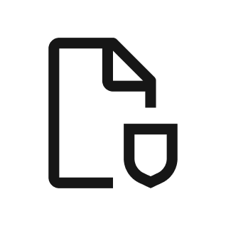

Da qui è possibile accedere a due interessanti documenti, pensati per docenti e studenti, utili per saperne di più sulle leggi italiane che tutelano privacy e reputazione online.

###### Privacy per educatori
Una risorsa per insegnanti ed educatori che vogliano saperne di più sulle basi giuridiche della gestione della privacy e dei dati online, così da supportare le più giovani e i più giovani nell'utilizzo degli strumenti digitali.
<DownloadButton link="/Privacy_per_educatori.pdf" text="scarica"></DownloadButton>

###### Privacy per studenti
Una risorsa che aiuta le più giovani e i più giovani a comprendere le fondamenta ed il funzionamento delle leggi che proteggono la nostra privacy e reputazione online.
<DownloadButton link="/Privacy_per_studenti.pdf" text="scarica"></DownloadButton>
