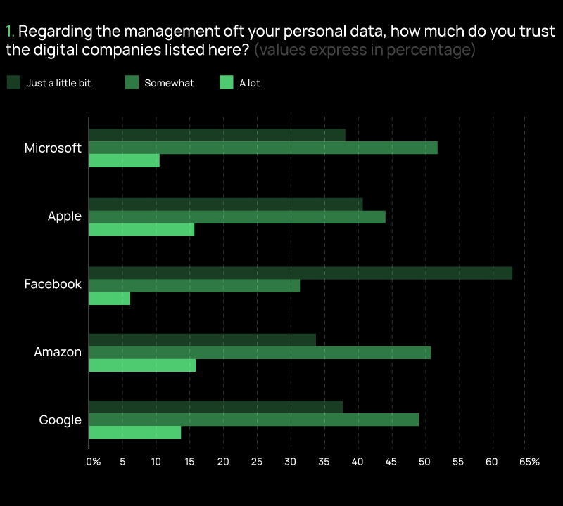
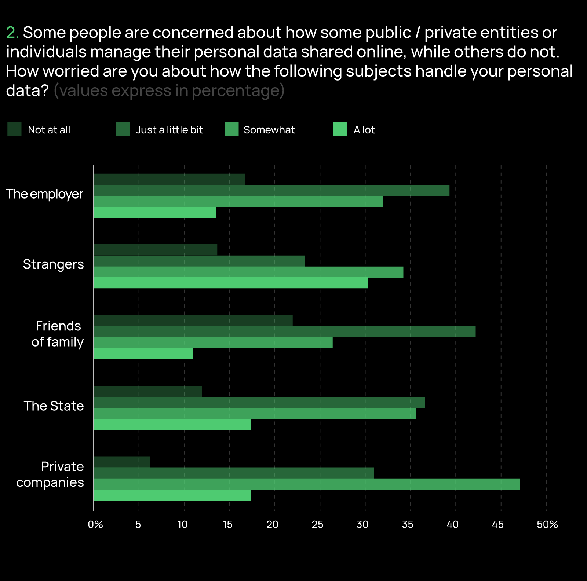

#### Introduction
More and more people are used to (consciously or unconsciously) “leave traces” of their personal data when surfing the Internet, logging into apps and websites, buying services and products online, etc. However there is little knowledge on trust that people put in the actors who handle digital data, and on their attitudes towards processes of digital data exploitation for business and non-business purposes. To address these topics, we carried out the survey “The citizens and the value of digital data” (N=3,156). We administered the questionnaire to a quota sample of the Italian Internet population (aged 18 and above), adopting a mixed-mode design: a CAWI survey on respondents from the Opinione.net non-probability online panel (N=2,249), followed by a CATI survey on respondents who have a phone number (both landline and mobile), own/have at their disposal at least one digital device, and use at least three features offered by the digital devices (N=907). The questionnaire includes various sections on different topics, such as ownership and frequency of use of digital devices, awareness about how and to which aims digital data are extracted and exploited, data sharing behaviors, the economic value that personal digital data produce, attitudes towards online data protection, etc. Here we focus on results regarding trust in the digital companies and (potential) worries about how some actors manage people’s digital data.

#### Output 1
We asked respondents to indicate their level of trust in the GAFAM (Google, Amazon, Facebook, Apple, and Microsoft) companies, selecting from “just a little trust”, “somewhat trust” or “a lot trust”. Overall, putting GAFAM together in a trust index (range from 0 to 10), the mean value of respondents’ trust in digital companies is 3.4. 

#### Output 2
We then tried to investigate if people’s attitudes go beyond the feeling of trust and translate into worries about the management of digital data by both public / private entities and specific categories of individuals. In particular, we focused on the respondents’ concerns towards handling practices of private companies, the State, friends or family, strangers, and the employer. Taken together, the mean value of the respondents’ worries, measured by a worry index (range from 0 to 10), is 5.2. This seems to highlight that, overall, the people’s concerns are not very critical.

However, if we look at each specific entity/individual (Graph 2), we find that respondents are more worried about personal data management by strangers (63.6% are “somewhat” or “a lot” worried) and private companies (63.5% are “somewhat” or “a lot” worried), while they are less worried about digital data handling behaviors of friends or family (63.3% are “just a little” or “not at all” worried) and the employer (55.3% are “just a little” or “not at all” worried). Findings on worries about private companies are in line with the low mean value measured on the trust index: the less trust, the greater concern.
