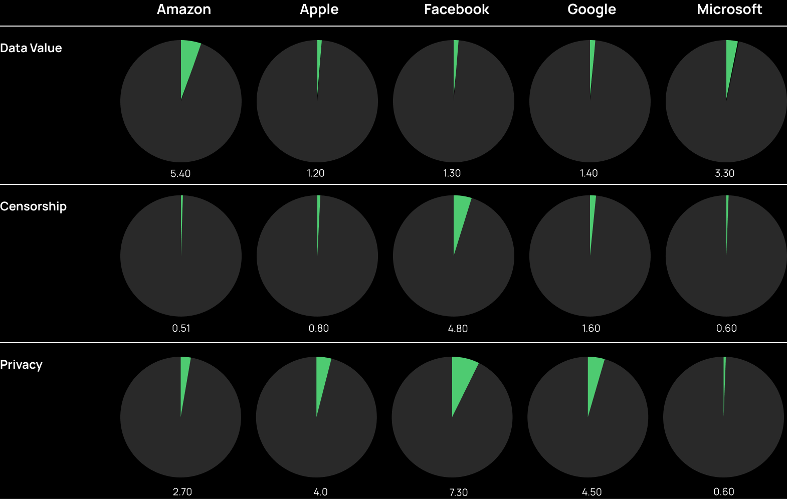

#### Introduction
A major issue when dealing with surveillance capitalism is that of visibility. In fact, more than a simple technology per se, surveillance capitalism is rather a complex socio-technical system aimed at extracting data from citizens, along with value embedded in such data. On the one hand, on a technical side, such process of data extraction is largely invisible since it is enacted by an [inextricable network](https://journals.sagepub.com/doi/10.1177/20539517211025061) made by a multiplicity of devices, platforms, infrastructures and business intermediaries (e.g., data brokers, data vendors, data suppliers, data analysts, etc.). On the other hand, from a cultural perspective, data extraction can be deemed invisible since it is an ‘always-on’ process playing out within users’ everyday digital practices, activities and navigation - and so very difficult to be seen and perceived by citizens. 

Therefore, we asked ourselves whether and to what extent surveillance capitalism can be made visible as well as whether and to what extent one can visualize people’s imaginaries of surveillance capitalism. To try answering this question we turned to Twitter and the countless digital traces users leave behind on the platform - traces that we captured and explored with ad hoc data visualization techniques. 

Specifically we collected 1,260,467 tweets from 01/01/2019 to 01/01/2022 (written in Italian), by following these five keywords: ‘Google’, ‘Amazon’, ‘Facebook’, ‘Apple’, ‘Microsoft’ - (aka GAFAM, the five champions of surveillance capitalism). Then, we submitted the dataset to two different kinds of analysis, which, in turn, generate two different visual outputs.  

#### Output 1
After a thorough manual analysis of the tweets, we identified three main categories that capture the key topics typically associated with surveillance capitalism: data value (e.g. tweets dealing with matters of advertising or financial market); censorship (e.g., tweets dealing with pieces of content or users banned by a certain platform); privacy (e.g., tweets dealing with issues of data protection). Then we instructed a classifier to automatically identify those topics in the whole dataset.

*The visualization displays the distribution of the categories (in %) across the five platforms.*

From the visualization above, it is possible to get two main insights. First, on the whole dataset, discourses about data value, censorship, and privacy are minoritarian. When tweeting about GAFAM, users tend to focus on other topics rather than surveillance capitalism. This result confirms a general lack of awareness and interest regarding questions of big data value, extraction, exploitation, protection, breach, management, etc. - which is largely documented by the current academic literature. Second, it is interesting to notice how different platforms score differently according to the topic taken into consideration; specifically: a) Amazon attracts most of the tweets focusing on economic themes (probably given its explicit business vocation); b) Facebook seems to be associated with censorship issues (probably due to the several ‘scandals’ related to content moderation that affected the company over the last few years); c) all platforms seem to raise concerns about privacy and data protection. This last result echoes another well-known insight within the academic literature: when reflecting on the value of their own digital data, people tend to focus on individual forms of value (such as privacy), rather than collective ones (such as economic value).   

#### Output 2
From the whole dataset we extracted a sample of 250 most recurrent hashtags, which we manually assigned to 8 categories: data value (e.g., #ads), privacy (e.g., #cybersecurity) censorship (e.g.,#trumpbanned), platform (e.g., #facebook), news (e.g., #news), politics (e.g., #conte), covid (e.g., #contacttracing).    

This visualization is particularly interesting because it allows (so to speak) to ‘make visible’ the users’ imaginary about surveillance capitalism as well as observe the devices, procedures, operators, and conditions that, in their view, enforce the process of data extraction, appropriation, and exportation. In this sense, emblematic are some hashtags associated with the category ‘privacy’, such as: #smartphone, #cookie, #hacker, #spyware, #tracking, #smartglasses. The same goes for some hashtags related to the category ‘data value’, which indicate the means through which platforms monetize digital data: #marketing, #advertising, #trading, #monopoly.      

<iframe width="100%" height="600" frameborder="0"  src="https://observablehq.com/embed/e6dffe8a45059229@latest?cells=radialTreew"></iframe>